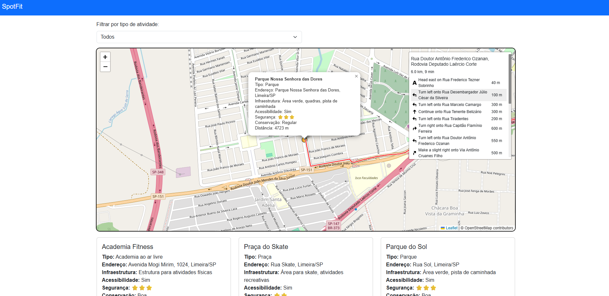
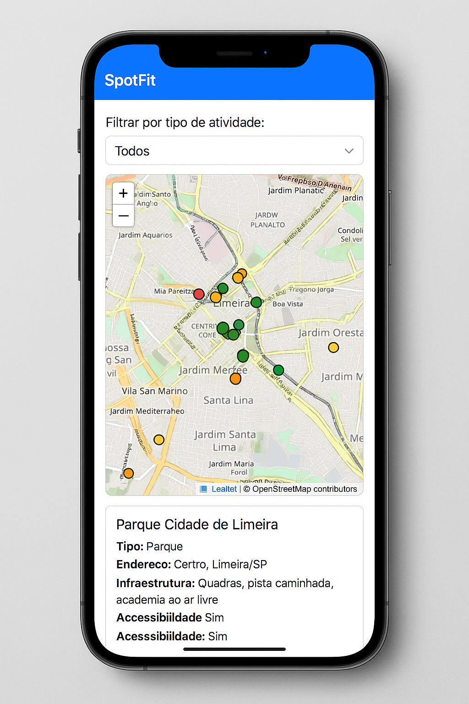

# SpotFit 🏞️📍

Aplicativo para mapeamento de locais públicos adequados para a prática de atividades físicas urbanas,
com foco em acessibilidade, saúde e bem-estar da população.

## 📸 Imagens do Sistema

### Tela principal do sistema

### Simulação de uso no celular

## 🚀 Funcionalidades
- Visualização de locais públicos em mapa interativo
- Filtros por tipo de atividade (praça, parque, academia ao ar livre, etc.)
- Informações detalhadas de cada local (infraestrutura, acessibilidade, segurança e conservação)
- Banco de dados de locais coletados manualmente
- Protótipo web responsivo

## 🛠️ Tecnologias Utilizadas
- **Frontend:** HTML, CSS, JavaScript, Leaflet.js (mapas interativos)
- **Backend:** Python (Flask) + Microsoft SQL Server

## 📂 Estrutura do Projeto
spotfit/
├── backend/                # API 
│   └── app.py              # Arquivo principal da API (Flask)   
│
└── frontend/               # Interface do usuário
    ├── index.html
    ├── style.css
    └── script.js
